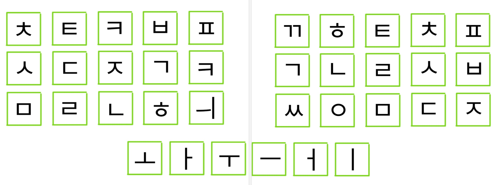

# split-steno

qmk를 사용해 속기 기능을 구현해보았다. 

왼쪽은 초성, 아래는 중성(모음), 오른쪽이 종성(받침) 이다.

지금부터 속기 기능에 대해 자세히 알아보자. (짧은 버전 readme_short.md)

## 1. 모아치기

'나는 할 수 있다.'라는 문장을 키보드로 쳐보자 그러면 대부분 'ㄴ' 'ㅏ' 'ㄴ' 'ㅡ' 'ㄴ' '(공백)' 'ㅎ' ....... 그렇게 총  20번의 키를 누를 것이다.

하지만 속기 키보드를 가진 우리는 다르다 '나' '는' '(공백)' '할' '(공백)' '수' '(공백)' '있' '다' '.' 10번이면 문장을 완성할 수 있다.

그렇다 모아치기란 음소 단위가 아닌 음절(글자) 단위로 글을 입력할 수 있는 것이다.

어떻게 가능한 걸까.  

답은 간단하다.

'나'를 입력할 때 'ㄴ'과 'ㅏ를 동시에 눌렸다 떼는 것이다. (사실 동시까진 필요없고 같이 눌렀다 떼면 된다) 

그럼 우리 한번 키맵을 보고 '있'을 쳐보는 상상을 해보자.

세상에! 왼쪽에 'ㅇ'이 없다. (오른쪽의 'ㅇ'은 받침용 'ㅇ'이다)

그렇다 초성이 'ㅇ'인 경우 아무런 초성을 누르지 않고 'ㅣ' 'ㅆ'을 누르면 된다. 

여기서 몇 가지 의문이 생길 수 있다

. shift가 없는데 쌍자음은 어떻게 입력하지?  
. 모음 중 없는 건 어떻게 입력하지?   
. 초성에 'ㅋ'은 왜 2개지?  

우선 쌍자음은 바로 아래의 키와 같이 누르면 된다.

ㅆ은 'ㅅ' 'ㅁ'  
ㄲ은 'ㄱ' 'ㅎ'  
ㅃ은 'ㅂ' 'ㄱ  
을 같이 누르면 된다. (받침에 ㄲ, ㅆ을 제외한 쌍자음은 적을 수 없다.

모음도 비슷하다.

'ㅘ', 'ㅝ'는 이미 알고 있듯이 'ㅗ' 'ㅏ', 'ㅜ' 'ㅓ  
'ㅛ', 'ㅑ'는 'ㅗ' 'ㅡ', 'ㅏ' 'ㅡ'   
'ㅒ'는 'ㅏ' 'ㅓ'  
'ㅖ'는 'ㅏ' 'ㅓ' 'ㅣ'  
같은 방식으로 입력하면 된다. 

ㅋ은 둘 중 오른쪽의 ㅋ이 받침 ㅋ이다. 
ㅋ이 받침으로 들어가는 글자는 녘, 엌, 읔 단 3개이기 때문에 내려진 결정이다.

그렇다고 ㅋ의 역할이 끝난 건 아니다. 왜냐하면 바로

## 2. 약어

바로 약어의 존재 때문이다.

아까 '나는 할 수 있다.'를 10번이면 칠 수 있다고 했던가?

아니 약어와 함께라면 단 3번 이면 된다.

'나는 ' '할 수 ' '있다. ' 3번이다. 

사실 아까 해결하지 못한 의문이 하나 더 있다.

'.'은 어떻게 입력함?

이 역시 약어가 있기에 가능하다.

받침 'ㅇ', 'ㅁ'를 누르면 . 이 입력된다.

'나는 '역시 'ㄴ' 'ㅏ' 그리고 받침 'ㄴ', 'ㅇ' ('는 '을 의미하는 약어)  
'할 수 '는 'ㅎ' 'ㅏ' 그리고 받침 'ㄹ', 'ㅅ' ('ㄹ 수 '를 의미)  
'있다. '는 약어 'ㅅ' 'ㅁ' ('있') 그리고 받침 'ㅂ' ('다. ') 
를 누르면 된다.

약어는 외워야 하는 게 흠이라지만 사용을 안 해도 되는 선택사항이기에 알아서 하길 바란다.  
참고로 약어 대부분을 없앤 버전과 그냥 남아있는 버전 두 개가 있다.

이 정도면 알아야 할 건 다 배운 것 같다.

처음에 낯선 키 배열과 시스템에 혼란과 스트레스가 있을지 모르지만 잘 이겨내길 바란다. 
